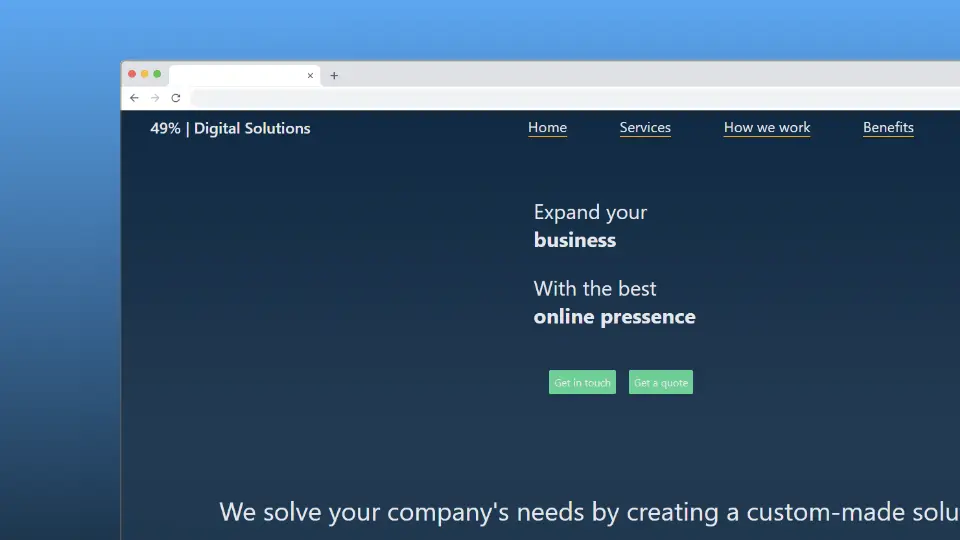

<p align="center">
    
</p>
<p align="center"><h1 align="center">PAG-AGENCIA</h1></p>
<p align="center">
</p>
<p align="center">
    
    
    
</p>
<br>

## 🔗 Tabla de Contenidos

- [📍 Resumen](#-resumen)
- [👾 Características](#-características)
- [📁 Estructura del Proyecto](#-estructura-del-proyecto)
  - [📂 Índice del Proyecto](#-índice-del-proyecto)
- [🚀 Comenzando](#-comenzando)
  - [☑️ Requisitos](#-prerrequisitos)
  - [🤖 Link](#🤖-uso)

---

## 📍 Resumen

<code>❯ Página de agencia con formulario de contacto funcional</code> 

---

## 👾 Características

- Diseño responsivo
- Formulario de contacto funcional
- Navegación intuitiva
- Sección de servicios
- Sección de beneficios
- Sección de contacto
- Animaciones y transiciones suaves
- Código modular y reutilizable
- Uso de hooks personalizados
- Componentes estilizados con CSS Modules
- Integración con API para envío de formularios
- Buenas prácticas de desarrollo y estructura de proyecto clara

---

## 📁 Estructura del Proyecto

```sh
└── pag-agencia/
    ├── README.md
    ├── package-lock.json
    ├── package.json
    ├── public
    │   ├── favicon-blanco.png
    │   ├── index.html
    │   ├── logo192.png
    │   ├── logo512.png
    │   ├── manifest.json
    │   └── robots.txt
    └── src
        ├── App.js
        ├── App.test.js
        ├── Components
        ├── Hooks
        ├── Screens
        ├── assets
        ├── index.css
        ├── index.js
        ├── logo.svg
        ├── reportWebVitals.js
        └── setupTests.js
```


### 📂 Índice del Proyecto
<details open>
    <summary><b><code>PAG-AGENCIA/</code></b></summary>
    <details> <!-- __root__ Submodule -->
        <summary><b>__root__</b></summary>
        <blockquote>
            <table>
            <tr>
                <td><b><a href='https://github.com/fergone03/pag-agencia/blob/master/package-lock.json'>package-lock.json</a></b></td>
                <td><code>Archivo de bloqueo de dependencias</code></td>
            </tr>
            <tr>
                <td><b><a href='https://github.com/fergone03/pag-agencia/blob/master/package.json'>package.json</a></b></td>
                <td><code>Archivo de configuración del proyecto</code></td>
            </tr>
            </table>
        </blockquote>
    </details>
    <details> <!-- src Submodule -->
        <summary><b>src</b></summary>
        <blockquote>
            <table>
            <tr>
                <td><b><a href='https://github.com/fergone03/pag-agencia/blob/master/src/index.css'>index.css</a></b></td>
                <td><code>Estilos globales de la aplicación</code></td>
            </tr>
            <tr>
                <td><b><a href='https://github.com/fergone03/pag-agencia/blob/master/src/App.test.js'>App.test.js</a></b></td>
                <td><code>Pruebas unitarias para App</code></td>
            </tr>
            <tr>
                <td><b><a href='https://github.com/fergone03/pag-agencia/blob/master/src/setupTests.js'>setupTests.js</a></b></td>
                <td><code>Configuración de pruebas</code></td>
            </tr>
            <tr>
                <td><b><a href='https://github.com/fergone03/pag-agencia/blob/master/src/App.js'>App.js</a></b></td>
                <td><code>Componente principal de la aplicación</code></td>
            </tr>
            <tr>
                <td><b><a href='https://github.com/fergone03/pag-agencia/blob/master/src/reportWebVitals.js'>reportWebVitals.js</a></b></td>
                <td><code>Reporte de métricas de rendimiento</code></td>
            </tr>
            <tr>
                <td><b><a href='https://github.com/fergone03/pag-agencia/blob/master/src/index.js'>index.js</a></b></td>
                <td><code>Punto de entrada de la aplicación</code></td>
            </tr>
            </table>
            <details>
                <summary><b>Componentes</b></summary>
                <blockquote>
                    <table>
                    <tr>
                        <td><b><a href='https://github.com/fergone03/pag-agencia/blob/master/src/Components/Step.js'>Step.js</a></b></td>
                        <td><code>Componente de paso</code></td>
                    </tr>
                    <tr>
                        <td><b><a href='https://github.com/fergone03/pag-agencia/blob/master/src/Components/NavBar.js'>NavBar.js</a></b></td>
                        <td><code>Componente de barra de navegación</code></td>
                    </tr>
                    <tr>
                        <td><b><a href='https://github.com/fergone03/pag-agencia/blob/master/src/Components/NavBar.module.css'>NavBar.module.css</a></b></td>
                        <td><code>Estilos para NavBar</code></td>
                    </tr>
                    <tr>
                        <td><b><a href='https://github.com/fergone03/pag-agencia/blob/master/src/Components/Step.module.css'>Step.module.css</a></b></td>
                        <td><code>Estilos para Step</code></td>
                    </tr>
                    </table>
                </blockquote>
            </details>
            <details>
                <summary><b>Hooks</b></summary>
                <blockquote>
                    <table>
                    <tr>
                        <td><b><a href='https://github.com/fergone03/pag-agencia/blob/master/src/Hooks/scrollPosition.js'>scrollPosition.js</a></b></td>
                        <td><code>Hook para posición de scroll</code></td>
                    </tr>
                    </table>
                </blockquote>
            </details>
            <details>
                <summary><b>Pantallas</b></summary>
                <blockquote>
                    <table>
                    <tr>
                        <td><b><a href='https://github.com/fergone03/pag-agencia/blob/master/src/Screens/Home.module.css'>Home.module.css</a></b></td>
                        <td><code>Estilos para Home</code></td>
                    </tr>
                    <tr>
                        <td><b><a href='https://github.com/fergone03/pag-agencia/blob/master/src/Screens/Benefits.js'>Benefits.js</a></b></td>
                        <td><code>Componente de beneficios</code></td>
                    </tr>
                    <tr>
                        <td><b><a href='https://github.com/fergone03/pag-agencia/blob/master/src/Screens/Contact.js'>Contact.js</a></b></td>
                        <td><code>Componente de contacto</code></td>
                    </tr>
                    <tr>
                        <td><b><a href='https://github.com/fergone03/pag-agencia/blob/master/src/Screens/Home.js'>Home.js</a></b></td>
                        <td><code>Componente de inicio</code></td>
                    </tr>
                    <tr>
                        <td><b><a href='https://github.com/fergone03/pag-agencia/blob/master/src/Screens/Services.module.css'>Services.module.css</a></b></td>
                        <td><code>Estilos para Services</code></td>
                    </tr>
                    <tr>
                        <td><b><a href='https://github.com/fergone03/pag-agencia/blob/master/src/Screens/Contact.module.css'>Contact.module.css</a></b></td>
                        <td><code>Estilos para Contact</code></td>
                    </tr>
                    <tr>
                        <td><b><a href='https://github.com/fergone03/pag-agencia/blob/master/src/Screens/HowWeWork.js'>HowWeWork.js</a></b></td>
                        <td><code>Componente de cómo trabajamos</code></td>
                    </tr>
                    <tr>
                        <td><b><a href='https://github.com/fergone03/pag-agencia/blob/master/src/Screens/Services.js'>Services.js</a></b></td>
                        <td><code>Componente de servicios</code></td>
                    </tr>
                    <tr>
                        <td><b><a href='https://github.com/fergone03/pag-agencia/blob/master/src/Screens/HowWeWork.module.css'>HowWeWork.module.css</a></b></td>
                        <td><code>Estilos para HowWeWork</code></td>
                    </tr>
                    <tr>
                        <td><b><a href='https://github.com/fergone03/pag-agencia/blob/master/src/Screens/Benefits.module.css'>Benefits.module.css</a></b></td>
                        <td><code>Estilos para Benefits</code></td>
                    </tr>
                    </table>
                </blockquote>
            </details>
        </blockquote>
    </details>
    <details> <!-- public Submodule -->
        <summary><b>public</b></summary>
        <blockquote>
            <table>
            <tr>
                <td><b><a href='https://github.com/fergone03/pag-agencia/blob/master/public/index.html'>index.html</a></b></td>
                <td><code>Archivo HTML principal</code></td>
            </tr>
            <tr>
                <td><b><a href='https://github.com/fergone03/pag-agencia/blob/master/public/manifest.json'>manifest.json</a></b></td>
                <td><code>Archivo de manifiesto de la aplicación</code></td>
            </tr>
            <tr>
                <td><b><a href='https://github.com/fergone03/pag-agencia/blob/master/public/robots.txt'>robots.txt</a></b></td>
            </tr>
            </table>
        </blockquote>
    </details>
</details>

---
## 🚀 Comenzando

### ☑️ Requisitos

Antes de comenzar con pag-agencia, asegúrate de que tu entorno de ejecución cumpla con los siguientes requisitos:

- Navegador web compatible con HTML5, CSS3 y JavaScript.
- SO con animaciones activas.

### 🤖 
Link
Visita pag-agencia usando el siguiente comando:
https://49percent.netlify.app 
